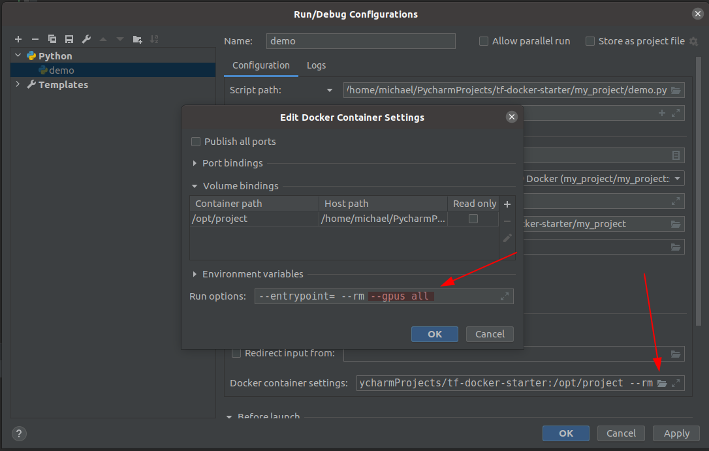
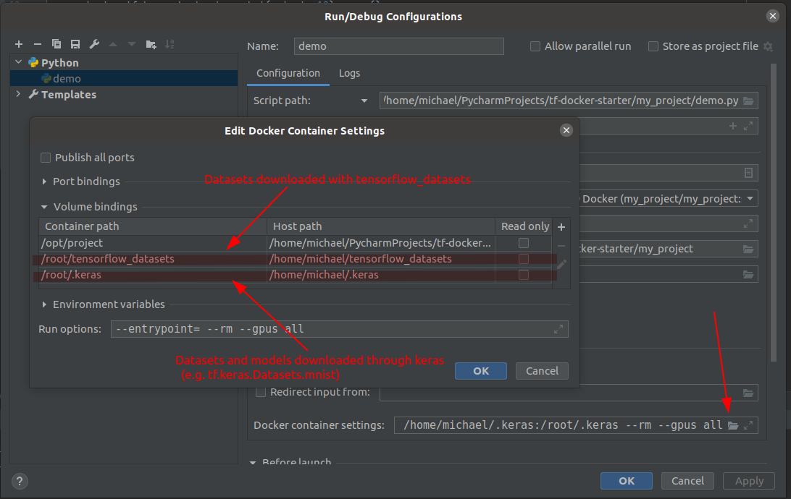

## Using this template in Pycharm
Follow these steps to quickly set up your docker environment in pycharm.

### TLDR
> $ bash ./scripts/gen_dockerf.sh my_project 
>
> $ bash ./scripts/docker_build.sh my_project

> [Settings] > [Project:...] > [Python Interpreter] > ['wheel'] > [Add] > [Docker]. **Set:** Server: `Docker`,  Image Name: `my_project/my_project:snapshot`
>
> Exit with [ok] and [ok]. Bottom right now shows "Remote Python 3.x.x Docker ..."

Optional steps (After running your code and thus generating a run config):

> **Enable GPUs (Linux only):**
>
> [Run] > [Edit Configurations] > *select your config* >
> [Docker Container Settings] > [:open_file_folder:] >
> [Run Options] > Append `--gpus all` 


> **Mount additional volumes (e.g. datasets):**
>
> [Run] > [Edit Configurations] > *select your config* >
> [Docker Container Settings] > [:open_file_folder:] >
> [Volume Bindings] > [+]


Any problems with this? Follow the comprehensive instructions here: 

### Step 1: Generate the docker files

First, we will run a script that generates Dockerfiles based on our `requirements.txt`.
The appropriate tensorflow version (>=2.0.0) is used to decide which tensorflow docker image
should be used to build on. 
Thus, our `requirements.txt` file must contain a `tensorflow==2.x.x` import.

```console
m@m:~/.../tf-docker-starter$ bash ./scripts/gen_dockerf.sh my_project
tensorflow dependency:  2.3.0
Regenerated ./docker/ folder based on your requirements.txt
```

### Step 2: Build a docker image

We will now build a docker image with all our dependencies installed.

```console
m@m:~/.../tf-docker-starter$ bash ./scripts/docker_build.sh my_project
Using default tag: 'my_project/my_project:snapshot'
Sending build context to Docker daemon  226.8kB
Step 1/4 : FROM tensorflow/tensorflow:2.3.0
 ---> 539d0e818045
Step 2/4 : RUN /usr/bin/python3 -m pip install --upgrade pip
 ---> Using cache
 ---> ff2d95590d8e
Step 3/4 : COPY ./docker/requirements.txt requirements.txt
 ---> Using cache
 ---> efed1a8973d2
Step 4/4 : RUN pip install -r requirements.txt
 ---> Using cache
 ---> bd389566c027
Successfully built bd389566c027
Successfully tagged my_project/my_project:snapshot

```

The first time you run this script, the output will be longer, but as long as it ends with
*Successfully tagged my_project/my_project:snapshot* you should be fine.

**Linux only:** Use the `-g` flag to enable GPU use:
  > bash ./scripts/docker_build.sh **-g** my_project
              
### Optional Step: Enable GPU Use
Open the run configs, then add the `--gpus all` flag as follows: 


### Optional Step: Mount Additional Volumes
Example: The following example shows how to persists tensorflow datasets on the host, 
and thus preventing a re-download on every execution.

